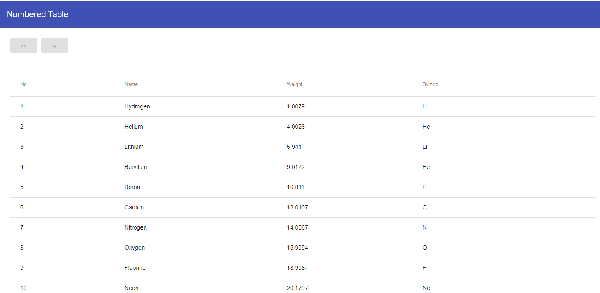

# Angular Numbered Table

The repository shows how to move a row inside a table made with Angular.

# Example

https://stackblitz.com/edit/angular-numbered-table

# Preview



# Service 

```typescript
import { Injectable } from '@angular/core';
import {PeriodicElement} from "../model/periodic-element";

@Injectable({
  providedIn: 'root'
})
export class PeriodicElementService {

  list: PeriodicElement[] = [
    {position: 1, name: 'Hydrogen', weight: 1.0079, symbol: 'H'},
    {position: 2, name: 'Helium', weight: 4.0026, symbol: 'He'},
    {position: 3, name: 'Lithium', weight: 6.941, symbol: 'Li'},
    {position: 4, name: 'Beryllium', weight: 9.0122, symbol: 'Be'},
    {position: 5, name: 'Boron', weight: 10.811, symbol: 'B'},
    {position: 6, name: 'Carbon', weight: 12.0107, symbol: 'C'},
    {position: 7, name: 'Nitrogen', weight: 14.0067, symbol: 'N'},
    {position: 8, name: 'Oxygen', weight: 15.9994, symbol: 'O'},
    {position: 9, name: 'Fluorine', weight: 18.9984, symbol: 'F'},
    {position: 10, name: 'Neon', weight: 20.1797, symbol: 'Ne'},
  ];

  constructor() {
  }

  update(index, field, value) {
    this.list = this.list.map((e, i) => {
      if (index === i) {
        let result = {...e, [field]: value};
        return result;
      }
      return e;
    });
    this.list.sort((a, b) => a.position - b.position);
  }
}
```
# Table
```typescript
import {Component, OnInit, ViewChild} from '@angular/core';
import {MatSort, MatTableDataSource} from "@angular/material";
import {PeriodicElement} from "../model/periodic-element";
import {PeriodicElementService} from "../service/periodic-element.service";

@Component({
  selector: 'app-book-table',
  templateUrl: './book-table.component.html',
  styleUrls: ['./book-table.component.scss']
})
export class BookTableComponent implements OnInit {

  displayedColumns: string[] = ['position', 'name', 'weight', 'symbol'];
  dataSource = new MatTableDataSource<PeriodicElement>();
  selectedRowIndex: number;
  upDisabled: boolean;
  downDisabled: boolean;

  @ViewChild(MatSort, {static: true}) sort: MatSort;

  constructor(private periodicElementService: PeriodicElementService) {
  }

  ngOnInit() {
    this.dataSource.sort = this.sort;
    this.upDisabled = true;
    this.downDisabled = true;
    this.getBooks();
  }

  moveUp() {
    let index = this.selectedRowIndex;
    if (index > 0) {
      let tmp = this.dataSource.data[index];
      this.periodicElementService.update(index - 1, 'position', tmp.position);
      this.periodicElementService.update(index, 'position', tmp.position - 1);
      this.select(index - 1);
      this.getBooks();
    }
  }

  moveDown() {
    let index = this.selectedRowIndex;
    if (index < this.dataSource.data.length) {
      let tmp = this.dataSource.data[index];
      this.periodicElementService.update(index + 1, 'position', tmp.position);
      this.periodicElementService.update(index, 'position', tmp.position + 1);
      this.select(index + 1);
      this.getBooks();
    }
  }

  select(index: number) {
    this.selectedRowIndex = index;
    this.upDisabled = index === 0 ? true : false;
    this.downDisabled = index === this.dataSource.data.length - 1 ? true : false;
  }

  private getBooks() {
    this.dataSource.data = this.periodicElementService.list;
  }
}
```
```angular2html
<section id="books">
  <div fxLayout fxLayoutAlign="start center" fxLayoutGap="10px" class="p-1">
    <span fxFlex="100%" fxLayout fxLayoutAlign="start center" fxLayoutGap="10px">
      <button mat-raised-button (click)="moveUp()" [disabled]="upDisabled">
        <mat-icon>keyboard_arrow_up</mat-icon>
      </button>
      <button mat-raised-button (click)="moveDown()" [disabled]="downDisabled">
        <mat-icon>keyboard_arrow_down</mat-icon>
      </button>

    </span>
  </div>

  <table mat-table [dataSource]="dataSource" class=" mat-elevation-z8" class="p-1"
         matSort matSortActive="position" matSortDirection="asc" matSortDisableClear>
    <ng-container matColumnDef="position">
      <th mat-header-cell *matHeaderCellDef> No.</th>
      <td mat-cell *matCellDef="let element"> {{element.position}}</td>
    </ng-container>

    <ng-container matColumnDef="name">
      <th mat-header-cell *matHeaderCellDef> Name</th>
      <td mat-cell *matCellDef="let element"> {{element.name}}</td>
    </ng-container>

    <ng-container matColumnDef="weight">
      <th mat-header-cell *matHeaderCellDef>Weight</th>
      <td mat-cell *matCellDef="let element"> {{element.weight}}</td>
    </ng-container>

    <ng-container matColumnDef="symbol">
      <th mat-header-cell *matHeaderCellDef>Symbol</th>
      <td mat-cell *matCellDef="let element"> {{element.symbol}}</td>
    </ng-container>

    <tr mat-header-row *matHeaderRowDef="displayedColumns"></tr>
    <tr mat-row *matRowDef="let row; columns: displayedColumns; let index = index" (click)="select(index)"
        [ngClass]="{'highlightTableColor': selectedRowIndex == index}"></tr>
  </table>
</section>

```
```scss
table {
  width: 100%;
  overflow-x: auto;
  overflow-y: hidden;
}

th.mat-header-cell {
  text-align: left;
  max-width: 300px !important;
}


.highlightTableColor{
  background-color: whitesmoke;
}

```

 
 
